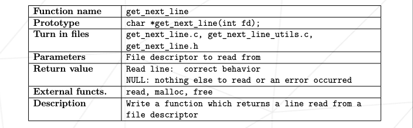

# get_next_line

# Index

*  [Goals](#Goals)
*  [Common Instructions](#Common-Instructions)
*  [Mandatory part - Get_next_line](#Mandatory-part-Get_next_line)
*  [Bonus part](#Bonus-part)

# Goals
This project will not only allow you to add a very convenient function to your collection, but it will also allow you to learn a highly interesting new concept in C programming: static variables. 
# Common Instructions
**1-** Your project must be written in accordance with the Norm. If you have bonus files/functions, they are included in the norm check and you will receive a 0 if there is a norm error inside. 
**2-** Your functions should not quit unexpectedly (segmentation fault, bus error, double free, etc) apart from undefined behaviors. If this happens, your project will be considered non functional and will receive a 0 during the evaluation. 
**3-** All heap allocated memory space must be properly freed when necessary. No leaks will be tolerated. 
**4-** If the subject requires it, you must submit a Makefile which will compile your source files to the required output with the flags **-Wall, -Wextra and -Werror**, and your **Makefile** must not relink. 
**5-** Your Makefile must at least contain the rules **$(NAME), all, clean, fclean and re**. 
**6-** To turn in bonuses to your project, you must include a rule bonus to your Makefile, which will add all the various headers, librairies or functions that are forbidden on the main part of the project. Bonuses must be in a different **file _bonus.{c/h}.** Mandatory and bonus part evaluation is done separately. 
**7-** If your project allows you to use your libft, you must copy its sources and its associated Makefile in a libft folder with its associated Makefile. Your project’s Makefile must compile the library by using its Makefile, then compile the project. 
**8-** We encourage you to create test programs for your project even though this work won’t have to be submitted and won’t be graded. It will give you a chance to easily test your work and your peers’ work. You will find those tests especially useful during your defence. Indeed, during defence, you are free to use your tests and/or the tests of the peer you are evaluating. 
**9-** Submit your work to your assigned git repository. Only the work in the git repository will be graded. If Deepthought is assigned to grade your work, it will be done after your peer-evaluations. If an error happens in any section of your work during Deepthought’s grading, the evaluation will stop. 

# Mandatory part - Get_next_line

**1-** Calling your function **get_next_line** in a loop will then allow you to read the text available on the file descriptor one line at a time until the end of it.  
**2-** Your function should return the line that has just been read. If there is nothing else to read or if an error has occurred it should return **NULL.** 
**3-** Make sure that your function behaves well when it reads from a file and when it reads from the standard input. 
**4-** libft is not allowed for this project. You must add a get_next_line_utils.c file which will contain the functions that are needed for your get_next_line to work. 
**5-** Your program must compile with the **flag -D BUFFER_SIZE=xx** which will be used as the buffer size for the read calls in your get_next_line. This value will be modified by your 
evaluators and by the moulinette. 
**6-** The program will be compiled in this way: **gcc -Wall -Wextra -Werror -D BUFFER_SIZE=42 <files>.c.** 
**7-** Your read must use the **BUFFER_SIZE** defined during compilation to read from a file or from stdin. This value will be modified during the evaluation for testing purposes. 
**8-** In the header file get_next_line.h you must have at least the prototype of the function **get_next_line.** 

**a-** **Does your function still work if the BUFFER_SIZE value is 9999? And if the BUFFER_SIZE value is 1? And 10000000? Do you know why?** 
**b-** **You should try to read as little as possible each time get_next_line is called. If you encounter a newline, you have to return the current line. Don’t read the whole file and then process each line.** 
**c-** **Don’t turn in your project without testing. There are many tests to run, cover your bases. Try to read from a file, from a redirection,from standard input. How does your program behave when you send a newline to the standard output? And CTRL-D?** 

**9-** lseek is not an allowed function. File reading must be done only once. 
**10-** We consider that **get_next_line** has undefined behavior if, between two calls, the same file descriptor switches to a different file before reading everything from the first fd. 
**11-** Finally we consider that get_next_line has undefined behavior when reading from a binary file. However, if you wish, you can make this behavior coherent. 
**12-** Global variables are forbidden. 
**13-** Important: The returned line should include the **’\n’**, except if you have reached the end of file and there is no **’\n’**. 

# Bonus part

The project get_next_line is straightforward and leaves very little room for bonuses, but we are sure that you have a lot of imagination. If you have aced the mandatory part, then by all means, complete this bonus part to go further. Just to be clear, no bonuses will be taken into consideration if the mandatory part isn’t perfect.Turn-in all 3 mandatory files ending by **_bonus.[c\h]** for this part. 
**1-** To succeed get_next_line with a single static variable. 
**2-** To be able to manage multiple file descriptors with your **get_next_line.** For example, if the file descriptors 3, 4 and 5 are accessible for reading, then you can call get_next_line once on 3, once on 4, once again on 3 then once on 5 etc. without losing the reading thread on each of the descriptors. 

**?! A good start would be to know what a static variable is:**
	https://en.wikipedia.org/wiki/Static_variable